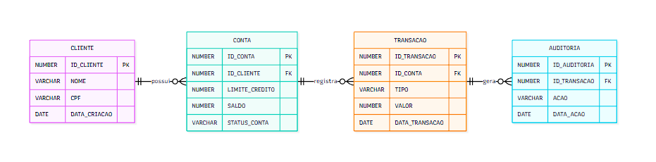

# 🏦 Sistema Bancário Implementado em Oracle PL/SQL

Projeto voltado ao desenvolvimento de um sistema bancário simplificado com centralização das regras de negócio em PL/SQL no banco de dados Oracle. Simula operações bancárias como cadastro de clientes, abertura de contas, depósitos, saques e consulta de saldo via function. As regras de negócio são centralizadas em package PL/SQL, com trigger para prevenção de saldo negativo e registro automático para auditoria das transações financeiras.

**Objetivo**:
- Aplicar PL/SQL na implementação de regras de negócio
- Demonstrar automação e auditoria através de triggers
- Simular arquitetura de sistemas financeiros
- Consolidar boas práticas de modelagem relacional e programação Oracle

**Contexto**: Projeto acadêmico desenvolvido na disciplina Laboratório de Desenvolvimento em Banco de Dados VI do curso Tecnologia em Banco de Dados da FATEC (Faculdade de Tecnologia de Bauru).

🎥 **Apresentação do Projeto (YouTube):** https://youtu.be/neQLM0JzVns

## ⚙️ Tecnologias Utilizadas

- Oracle Database XE 21c
- PL/SQL (Packages, Procedures, Functions, Triggers, Constraints)
- SQL
- Docker (Imagem `gvenzl/oracle-xe`)
- SQL*Plus
- Ubuntu via WSL

## 🏗️ Arquitetura do Projeto

O sistema foi estruturado em camadas lógicas dentro do banco de dados Oracle, centralizando as regras de negócio em PL/SQL e garantindo integridade referencial, consistência transacional, validações automatizadas e rastreabilidade das operações financeiras.

- **Camada de Dados**: Responsável pela estrutura relacional e armazenamento dos dados. É composta pelas tabelas `CLIENTE`, `CONTA` e `TRANSACAO`, utilizando chaves primárias, estrangeiras, constraints UNIQUE, CHECK e colunas com IDENTITY para geração automática de identificadores. Essa camada assegura persistência das informações, integridade referencial e consistência estrutural do banco.

- **Camada de Lógica**: Implementada por meio do package `pkg_bancario` (spec e body), que centraliza as regras de negócio do sistema. Contém as procedures `abrir_conta`, `deposito` e `saque`, responsáveis por validar dados, executar operações e registrar transações. Essa abordagem garante encapsulamento e controle das operações diretamente no banco.

- **Camada de Automação**: Auditoria automática implementada com a trigger `trg_prevent_saldo_negativo`, que impede atualizações que resultem em saldo inferior a zero, reforçando a segurança das operações.

- **Camada de Testes**: Composta por scripts SQL responsáveis por popular dados e executar cenários de teste, incluindo operações válidas e situações de erro/exceções, permitindo validar o comportamento do sistema e o funcionamento das regras implementadas.

## 🗃️ Modelagem de Dados

**Tabelas**
- `CLIENTE` → Dados cadastrais do correntista
- `CONTA` → Contas vinculadas ao cliente e saldo
- `TRANSACAO` → Histórico de depósitos e saques
- `AUDITORIA` → Registros automáticos de operações financeiras



## 📏 Regras de Negócio

- Cliente deve existir para abrir conta
- Número da conta deve ser único
- Depósitos somente com valores positivos
- Saques somente com valores positivos
- Conta deve existir para qualquer operação financeira
- Nenhuma conta pode ficar com saldo negativo
- Toda operação gera registro em `TRANSACAO`
- Auditoria automática das operações via trigger

## 🔄 Fluxo Operacional

1. Cliente é cadastrado na base de dados  
2. Conta é criada via procedure `abrir_conta`  
3. Operações financeiras (`deposito` e `saque`) são executadas  
4. O saldo da conta é atualizado  
5. A transação é registrada na tabela `TRANSACAO`  
6. A trigger valida saldo negativo automaticamente  
7. O saldo pode ser consultado via função do package  


## 📁 Estrutura do Repositório

```bash
/banking-system-plsql
├── /sql
│   ├── 01_config_user.sql        # criação do usuário Oracle e permissões
│   ├── 02_tables.sql             # definição das tabelas, chaves, constraints e índices auxiliares
│   ├── 03_trigger.sql            # triggers de validação e controle de saldo
│   ├── 04_package_spec.sql       # interface pública do package PL/SQL
│   ├── 05_package_body.sql       # implementação da lógica de negócio
│   ├── 06_seed_data.sql          # dados iniciais para execução do sistema
│   └── 07_test_cases.sql         # cenários de teste e validações de regras
├── /docs
│   └── diagram.png               # diagrama ER da modelagem
└── README.md
```

## ⚙️ Como Executar o Projeto 

### 1) Subir Oracle XE no Docker
```bash
docker pull gvenzl/oracle-xe
docker run -d --name oracle-xe -p 1521:1521 -p 5500:5500 gvenzl/oracle-xe
```

### 2) Acessar o Container
```bash
docker exec -it oracle-xe bash
sqlplus sys/oracle as sysdba
```

### 3) Selecionar o PDB
```bash
ALTER SESSION SET CONTAINER = XEPDB1;
```

### 4) Executar Scripts
```bash
@01_config_user.sql
conn bancario_test/bancario@XEPDB1

@02_tables.sql
@03_trigger.sql
@04_package_spec.sql
@05_package_body.sql
@06_seed_data.sql
@07_test_cases.sql
```

### 5) Limpeza do Ambiente (Opcional)
```bash
ALTER SESSION SET CONTAINER = XEPDB1;
DROP USER bancario_test CASCADE;
```