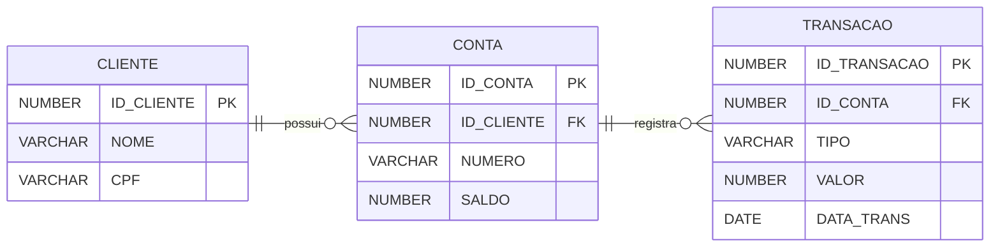

# 🏦 Sistema Bancário Implementado em Oracle PL/SQL

Projeto acadêmico de desenvolvimento de um sistema bancário que simula operações bancárias essenciais, aplicando PL/SQL para centralizar as regras de negócio em Oracle Database. O sistema contempla cadastro de clientes, abertura de contas bancárias, depósitos, saques, consulta de saldo e registro automático de transações financeiras para rastreabilidade das operações. As regras de negócio foram implementadas diretamente no banco de dados por meio de Procedures, Functions, Triggers, Packages e Constraints.

**Objetivos**:
- Implementar regras de negócio para operações bancárias utilizando PL/SQL no Oracle Database.
- Garantir consistência, integridade e rastreabilidade das transações financeiras.
- Utilizar Packages, Procedures, Functions, Triggers e Constraints para reproduzir conceitos presentes em sistemas financeiros e plataformas de core banking, como centralização da lógica de negócio, validações transacionais e rastreabilidade das operações.
- Aplicar boas práticas de modelagem relacional e desenvolvimento de banco de dados no Oracle Database.

🎥 **Vídeo de Apresentação do Projeto:** https://youtu.be/neQLM0JzVns

## ⚙️ Tecnologias Utilizadas

- **Oracle Database XE 21c**: SGBD utilizado para armazenamento e execução das regras de negócio.
- **PL/SQL**: desenvolvimento de Packages, Procedures, Functions, Triggers e tratamento de exceções.
- **SQL**: definição de estruturas, consultas e manipulação de dados.
- **Docker**: execução isolada do Oracle XE.
- **SQL*Plus**: administração, execução e testes dos scripts.
- **Ubuntu (WSL)**: ambiente Linux para execução do banco de dados.
- **Windows 11**: sistema operacional hospedeiro.

## 📏 Funcionalidades e Regras de Negócio

- **👤 Cadastro de Clientes**
	- Registro de clientes com informações cadastrais.
	- CPF único para cada cliente.
	- Validação de integridade dos dados cadastrados.

- **🏦 Abertura de Contas**
	- Conta pode ser criada apenas para clientes previamente cadastrados.
	- Associação automática entre cliente e conta.
	- Identificação única para cada conta bancária.

- **💰 Depósitos**
	- Aceita somente valores positivos.
	- Atualização automática do saldo da conta.
	- Registro automático da movimentação financeira.

- **💸 Saques**
	- Aceita somente valores positivos.
	- Impedimento de saldo negativo por meio de trigger.
	- Registro automático da movimentação financeira.

- **📊 Consulta de Saldo**
	- Implementada por meio de function.
	- Retorna o saldo atual da conta.
	- Valida a existência da conta antes da consulta.

- **📝 Registro de Transações**
	- Registro automático de todas as movimentações financeiras.
	- Armazena o histórico com tipo da operação, valor e data da transação.
	- Disponibiliza informações que permitem rastrear e auditar as operações executadas.

- **⚙️ Centralização das Regras de Negócio**
	- Procedures e Functions encapsuladas em Package PL/SQL.
	- Validações executadas diretamente no banco de dados.
	- Tratamento de exceções para operações inválidas.
	- Aplicação de constraints e integridade referencial para garantir consistência dos dados.

## 🏗️ Arquitetura do Projeto

O sistema foi estruturado em camadas lógicas dentro do banco de dados Oracle, centralizando as regras de negócio em PL/SQL e garantindo integridade referencial, consistência transacional, validações automatizadas e rastreabilidade das operações financeiras.

- **Camada de Dados**: Responsável pela estrutura relacional e armazenamento dos dados. É composta pelas tabelas `CLIENTE`, `CONTA` e `TRANSACAO`, utilizando chaves primárias, estrangeiras, constraints UNIQUE, CHECK e colunas com IDENTITY para geração automática de identificadores. Essa camada assegura persistência das informações, integridade referencial e consistência estrutural do banco.

- **Camada de Lógica**: Implementada por meio do package `pkg_bancario` (spec e body), que centraliza as regras de negócio do sistema. Contém as procedures `abrir_conta`, `deposito` e `saque`, além da function `consultar_saldo`, responsáveis por validar dados, executar operações e disponibilizar consultas ao saldo das contas.

- **Camada de Automação**: Implementada por meio da trigger `trg_prevent_saldo_negativo`, responsável por impedir atualizações que resultem em saldo inferior a zero, reforçando a integridade e a segurança das operações financeiras.

- **Camada de Testes**: Composta por scripts SQL responsáveis por popular dados e executar cenários de teste com operações válidas e situações de erro/exceções, permitindo validar o comportamento do sistema e o funcionamento das regras implementadas.

## 🔄 Fluxo Operacional

1. Cliente é cadastrado na base de dados  
2. Conta é criada via procedure `abrir_conta`  
3. Operações financeiras (`deposito` e `saque`) são executadas  
4. O saldo da conta é atualizado  
5. A transação é registrada na tabela `TRANSACAO`  
6. A trigger valida saldo negativo automaticamente  
7. O saldo pode ser consultado via função do package

## 🔧 Componentes

Relacionamento `Cliente → Conta → Transação`, seguindo práticas de normalização com regras de integridade referencial implementadas com FKs e constraints.

### Tabelas
- `CLIENTE`: Dados cadastrais do correntista
- `CONTA`: Contas vinculadas ao cliente e saldo
- `TRANSACAO`: Histórico de depósitos e saques

<p align="center"><strong>Modelagem de Dados - Diagrama ER (Mermaid)</strong></p>



### Package `pkg_bancario`

- `abrir_conta()` → criação de contas bancárias
- `deposito()` → realização de depósitos
- `saque()` → realização de saques
- `consultar_saldo()` → consulta do saldo da conta

### Trigger

- `trg_prevent_saldo_negativo` → impede atualização de saldo para valores negativos

## 📁 Estrutura do Repositório

```bash
/banking-system-plsql
├── /sql
│   ├── 01_user_config.sql        # criação do usuário Oracle e permissões
│   ├── 02_tables.sql             # definição das tabelas, chaves, constraints e índices auxiliares
│   ├── 03_trigger.sql            # triggers de validação e controle de saldo
│   ├── 04_package_spec.sql       # interface pública do package PL/SQL
│   ├── 05_package_body.sql       # implementação da lógica de negócio
│   ├── 06_seed_data.sql          # dados iniciais para execução do sistema
│   └── 07_test_cases.sql         # cenários de teste e validações de regras
└── README.md
```

## ⚙️ Como Executar o Projeto 

### 1) Subir Oracle XE no Docker
```bash
docker pull gvenzl/oracle-xe
docker run -d --name oracle-xe -p 1521:1521 -p 5500:5500 gvenzl/oracle-xe
```

### 2) Acessar o banco como SYSDBA
```bash
docker exec -it oracle-xe bash
sqlplus sys/oracle as sysdba
```

### 3) Selecionar o PDB
```bash
ALTER SESSION SET CONTAINER = XEPDB1;
SHOW CON_NAME;
```

### 4) Executar Script de Configuração do Usuário
```bash
@01_user_config.sql
```

### 5) Conectar como Usuário da Aplicação
```bash
conn bancario_test/bancario@XEPDB1
SHOW USER;
```

### 6) Executar Scripts
```bash
@02_tables.sql
@03_trigger.sql
@04_package_spec.sql
@05_package_body.sql
@06_seed_data.sql
@07_test_cases.sql
```

## 🧪 Cenários de Teste

Casos validados durante o desenvolvimento:

- Cadastro de cliente
- Abertura de conta para cliente existente
- Depósito em conta válida
- Saque com saldo suficiente
- Consulta de saldo via Function
- Registro automático das movimentações em `TRANSACAO`
- Bloqueio de CPF duplicado
- Bloqueio de número de conta duplicado
- Impedimento de depósitos com valor menor ou igual a zero
- Impedimento de saques com valor menor ou igual a zero
- Impedimento de operações em contas inexistentes
- Impedimento de saldo negativo por Trigger

## 🎓 Contexto Acadêmico

Projeto acadêmico desenvolvido em 2025 por **Alana Queiroz Braga** na disciplina **Laboratório de Desenvolvimento em Banco de Dados VI** do Curso Superior de **Tecnologia em Banco de Dados** da **Faculdade de Tecnologia de Bauru (FATEC)**.